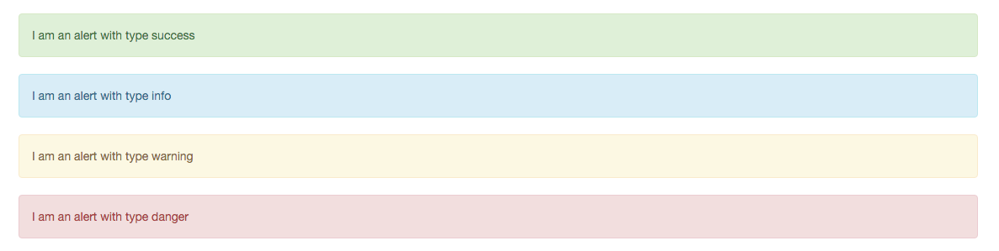

# GOV.UK Admin Template

Styles, scripts and templates wrapped up in a gem for getting up and running with [Bootstrap](http://getbootstrap.com) based backend admin apps.

This gem provides (via a Rails engine):
* jQuery
* Bootstrap 3 standard styles and javascript — including HTML5 and respond.js shims necessary for IE <= IE8
* An admin layout with header and footer
* A [lightweight javascript framework](JAVASCRIPT.md)
* Admin design patterns available from `/style-guide` (when routes are mounted)
* [CSS helpers and SASS variables](CSS.md) for the admin theme
* GOV.UK user friendly date formats
* Google Analytics tracking code (Universal Analytics), using the "GOV.UK apps" profile

[Apps using this gem](https://github.com/search?q=govuk_admin_template+user%3Aalphagov+filename%3AGemfile) include:
* [Collections publisher](https://github.com/alphagov/collections-publisher)
* [Imminence](https://github.com/alphagov/imminence)
* [Maslow](https://github.com/alphagov/maslow)
* [Publisher](https://github.com/alphagov/publisher)
* [Search admin](https://github.com/alphagov/search-admin)
* [Sign on](https://github.com/alphagov/signonotron2)
* [Service manual publisher](https://github.com/alphagov/service-manual-publisher)
* [Specialist publisher](https://github.com/alphagov/specialist-publisher)
* [Support](https://github.com/alphagov/support)
* [Transition](https://github.com/alphagov/transition)
* [Travel advice publisher](https://github.com/alphagov/travel-advice-publisher)

## Usage

Firstly, include the gem in your Gemfile, pinned to the appropriate version and run `bundle`:

```ruby
# Gemfile
gem 'govuk_admin_template', '~> 3.3'
```

At the top of `application.scss` include the styles (this provides all the mixins and variables from the gem as well as from bootstrap — [bootstrap mixins](https://github.com/twbs/bootstrap-sass/blob/master/vendor/assets/stylesheets/bootstrap/_mixins.scss)):
```css
/* application.scss */
@import 'govuk_admin_template';
```

In `application.html.erb` after any content blocks you want to include, render the base template:
```erb
# views/layouts/application.html.rb
<%= render template: 'layouts/govuk_admin_template' %>
```

The [base template](app/views/layouts/govuk_admin_template.html.erb) includes:
* Javascript and non-Javascript classes
* Mobile friendly viewport
* Bootstrap and jQuery javascript
* IE HTML5 and respondjs shims, and HTML classes
* header HTML
* footer HTML

You will also need to include your styles and javascripts:

```erb
# views/layouts/application.html.rb
<% content_for :head do %>
  <%= stylesheet_link_tag "application", media: "all" %>
  <%= javascript_include_tag 'application' %>
<% end %>
```

Note that `jquery` and `jquery_ujs` are already imported by `govuk_admin_template`,
so you should remove them from your `app/assets/javascripts/application.js`. This may
cause your jasmine tests to fail, so you'll need to include `assets/govuk-admin-template.js`
in your `spec/javascripts/support/jasmine.yml` like this:

```yaml
src_files:
  - assets/govuk-admin-template.js
```

It is recommended that the style guide is also made available within your app at the route `/style-guide`. Add this to your `config/routes.rb` file:

```ruby
# config/routes.rb
if Rails.env.development?
  mount GovukAdminTemplate::Engine, at: "/style-guide"
end
```

The gem source includes a [dummy app](spec/dummy) configured to behave like an app using the gem. If you have the gem checked out it can be run from the `spec\dummy` directory using `rails s`.

For Javascript usage, available modules and writing modules, see the [Javascript guide](JAVASCRIPT.md).

### Configuration

You can configure the gem with a config block in an initializer:

```ruby
# config/initializers/govuk_admin_template.rb
GovukAdminTemplate.configure do |c|
  c.app_title = "My Publisher"
  c.show_flash = true
  c.show_signout = true
  c.disable_google_analytics = false
end
```

### Forms

Some GOV.UK admin apps use the [Simple
Form](https://github.com/plataformatec/simple_form) library for writing form
markup. This repo contains a recommended configuration in
`lib/govuk_admin_template/simple_form.rb`.

To use this configuration:

0. Add `simple_form` to your Gemfile.
0. Add an initializer in `config/initializers/simple_form.rb` containing the
   following:

```
SimpleForm.setup do |config|
  GovukAdminTemplate.setup_simple_form(config)
end
```

This gem also provides an i18n file in `config/locales/simple_form.en.yml`.
This removes the need for this file to be present in the host project unless
specific customisations are required.

### Content blocks

The gem [uses nested layouts](http://guides.rubyonrails.org/layouts_and_rendering.html#using-nested-layouts) for customisation.

`content_for`     | Description
---------------   | -------------
`:app_title`      | Name of your admin application
`:app_home_path`  | Path to the home page of your application, defaults to `root_path`
`:content`        | Main content
`:head`           | HTML to include in the `<head>` of your application
`:page_title`     | Page title
`:navbar_items`   | A set of HTML list items (`<li>`) forming the primary navigation
`:navbar_right`   | Text to the right of the nav bar. Logged in user, sign out link, etc
`:footer_top` (optional) | Footer content before copyright text
`:footer_version` (optional) | Text indicating the release, eg commit SHA
`:body_start` (optional) | Just after the `<body>` tag
`:body_end` (optional) | Just before the `</body>` tag
`:full_width` (optional, boolean) | Expand content to edges of screen.
`:navbar` (optional) | Custom navbar content, overrides default navbar

Example navbar_items:
```erb
# views/layouts/application.html.rb
<% content_for :navbar_items do %>
  <li>
    <a href="#">navbar_item</a>
  </li>
<% end %>
```

### Date formats

The [gem includes](lib/govuk_admin_template/engine.rb) date and time formats which match the [recommended style](https://www.gov.uk/design-principles/style-guide/style-points#style-dates-and-times).

```ruby
# 1 January 2013
date.to_s(:govuk_date)

# 1:15pm, 1 January 2013
time.to_s(:govuk_date)

# 1 Jan 2013
date.to_s(:govuk_date_short)

# 1:15pm, 1 Jan 2013
time.to_s(:govuk_date_short)

# 1:15pm
time.to_s(:govuk_time)
```

### Environment indicators

The gem includes default styles for development, integration and production. This includes a coloured environment label, a coloured strip beneath the main navigation and a coloured favicon. They are based on two variables that are set at deploy time (if they aren’t set no indicator will be shown).

The following should be set within an initializer:

```ruby
# used for the classname and favicon
GovukAdminTemplate.environment_style = [integration|production|development]

# used for the human readable label
GovukAdminTemplate.environment_label = [Integration|Staging|Production|Development]
```

## Flash messages

Turn on flash messages in the config:

```ruby
# config/initializers/govuk_admin_template.rb
GovukAdminTemplate.configure do |c|
  c.show_flash = true
end
```

Use like this:

```ruby
# app/controllers/my_controller.rb
class MyController < ApplicationController
  def create
    if thing.save
      flash[:success] = "Your thing has been created!"
    else
      flash[:danger] = "Sorry, it did not work."
    end

    redirect_to :back
  end
end
```

We support `:success`, `:info`, `:warning` and `:danger`:



In Rails 4, you can register your types to allow them to be used as arguments
to `redirect_to`.

```ruby
# app/controllers/application_controller.rb
class ApplicationController < ActionController::Base
  add_flash_types :success, :info, :warning, :danger
end

# Now this works:
redirect_to :back, success: "Well done!"
redirect_to :back, danger: "This didn't work."
```

## Development

Clone the repository and run `bundle`.

The source files are in the [app](app) directory. Unlike other GOVUK frontend gems, there is no compile step. The app directory is included in the gem and hooked in as a Rails engine.

While developing it may be helpful to see how the gem will render. The dummy app at [spec/dummy](spec/dummy) is configured to act like an application using the gem and can be started from that directory using `rails s`. Changes will show immediately. The tests also run against this app.

The dummy app’s rake tasks have been loaded into the gem’s task list under the namespace `dummy_app` for convenience.

### Running tests

The default rake task runs all tests:
```
bundle exec rake
```

Layout and nested layouts are tested using RSpec and Capybara:
```
bundle exec rake spec
```

Javascript is tested using Jasmine and the [Jasmine gem](https://github.com/pivotal/jasmine-gem). Tests can be run either in the browser or on the command line via the dummy app’s tasks:
```sh
# browser
bundle exec rake dummy_app:jasmine

# command line
bundle exec rake dummy_app:jasmine:ci
```

## Publishing

Version bumps will automatically update RubyGems.org.
